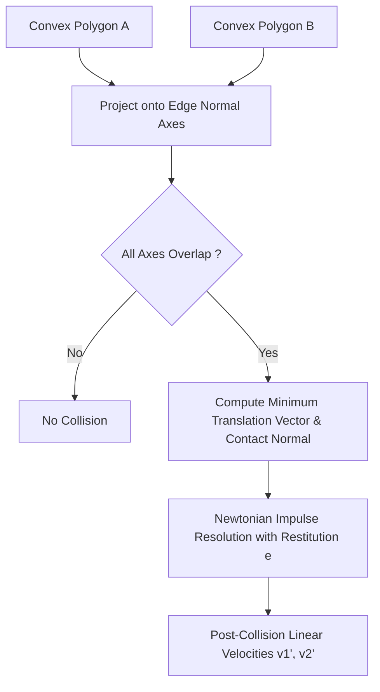

# genpark-rigid-body-2d-impulse-collision-resolver-skill

Agent Skill implementing **Separating Axis Theorem (SAT) convex polygon collision detection** and restitution impulse resolution for 2D rigid body dynamics.

## Architectural Overview

